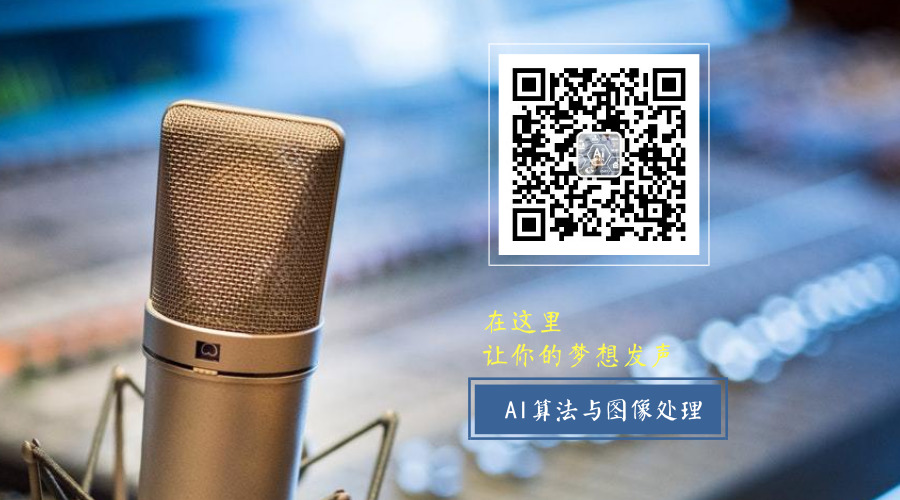

# 算法岗面经整理

[TOC]

本项目用于整理算法岗的面经（包含计算机视觉方向、机器学习、NLP等等方向），

[阿里巴巴计算机视觉算法实习生（2018届）](https://github.com/DWCTOD/interview/blob/master/detail/%E9%98%BF%E9%87%8C%E5%B7%B4%E5%B7%B4%E8%AE%A1%E7%AE%97%E6%9C%BA%E8%A7%86%E8%A7%89%E7%AE%97%E6%B3%95%E5%AE%9E%E4%B9%A0%E7%94%9F%EF%BC%882018%E5%B1%8A%EF%BC%89.md)

[阿里巴巴计算机视觉算法实习生（2018届）-1](https://github.com/DWCTOD/interview/blob/master/detail/%E9%98%BF%E9%87%8C%E5%B7%B4%E5%B7%B4%E8%AE%A1%E7%AE%97%E6%9C%BA%E8%A7%86%E8%A7%89%E7%AE%97%E6%B3%95%E5%AE%9E%E4%B9%A0%E7%94%9F%EF%BC%882018%E5%B1%8A%EF%BC%89-1.md)

[阿里达摩院-计算机视觉（2019届）](https://github.com/DWCTOD/interview/blob/master/detail/%E9%98%BF%E9%87%8C%E8%BE%BE%E6%91%A9%E9%99%A2-%E8%AE%A1%E7%AE%97%E6%9C%BA%E8%A7%86%E8%A7%89%EF%BC%882019%E5%B1%8A%EF%BC%89.md)

[阿里云算法岗实习生面经（1~3技术面，交叉面，hr面）（2019届）](https://github.com/DWCTOD/interview/blob/master/detail/%E9%98%BF%E9%87%8C%E4%BA%91%E7%AE%97%E6%B3%95%E5%B2%97%E9%9D%A2%E7%BB%8F%EF%BC%881~3%E6%8A%80%E6%9C%AF%E9%9D%A2%EF%BC%8C%E4%BA%A4%E5%8F%89%E9%9D%A2%EF%BC%8Chr%E9%9D%A2%EF%BC%89%EF%BC%882019%E5%B1%8A%EF%BC%89.md)

[b站算法岗(人工智能与技术部）三面面经（2020届）](https://github.com/DWCTOD/interview/blob/master/detail/b%E7%AB%99%E7%AE%97%E6%B3%95%E5%B2%97-%E4%BA%BA%E5%B7%A5%E6%99%BA%E8%83%BD%E4%B8%8E%E6%8A%80%E6%9C%AF%E9%83%A8%E4%B8%89%E9%9D%A2%E9%9D%A2%E7%BB%8F%EF%BC%882020%E5%B1%8A%EF%BC%89.md)

[京东cv方向-云视频四面+总监面（2020届）](https://github.com/DWCTOD/interview/blob/master/detail/%E4%BA%AC%E4%B8%9C20%E6%A0%A1%E6%8B%9Bcv%E6%96%B9%E5%90%91-%E4%BA%91%E8%A7%86%E9%A2%91%E3%80%90%E5%9B%9B%E9%9D%A2%2B%E6%80%BB%E7%9B%91%E9%9D%A2%E3%80%91%EF%BC%882020%E5%B1%8A%EF%BC%89.md)

[滴滴算法岗二面（2020届）](https://github.com/DWCTOD/interview/blob/master/detail/%E6%BB%B4%E6%BB%B420%E6%A0%A1%E6%8B%9B%E7%AE%97%E6%B3%95%E5%B2%97%E3%80%90%E4%BA%8C%E9%9D%A2%E3%80%91.md)

[中兴图像算法面经-技术面+综合面（2020届）](https://github.com/DWCTOD/interview/blob/master/detail/%E4%B8%AD%E5%85%B420%E6%A0%A1%E6%8B%9B%E5%9B%BE%E5%83%8F%E7%AE%97%E6%B3%95%E9%9D%A2%E7%BB%8F%E3%80%90%E6%8A%80%E6%9C%AF%E9%9D%A2%2B%E7%BB%BC%E5%90%88%E9%9D%A2%E3%80%91.md)

[图森未来感知算法工程师（2020届）](https://github.com/DWCTOD/interview/blob/master/detail/%E5%9B%BE%E6%A3%AE%E6%9C%AA%E6%9D%A5-%E6%84%9F%E7%9F%A5%E7%AE%97%E6%B3%95%E5%B7%A5%E7%A8%8B%E5%B8%88%E9%9D%A2%E7%BB%8F%EF%BC%882020%E5%B1%8A%EF%BC%89.md)

[腾讯AI Lab/阿里达摩院/华为/旷视/字节跳动/海康威视等公司大集合](https://github.com/DWCTOD/interview/blob/master/detail/%E8%85%BE%E8%AE%AFAI%20Lab%E9%98%BF%E9%87%8C%E8%BE%BE%E6%91%A9%E9%99%A2%E5%8D%8E%E4%B8%BA%E6%97%B7%E8%A7%86%E5%AD%97%E8%8A%82%E8%B7%B3%E5%8A%A8%E6%B5%B7%E5%BA%B7%E5%A8%81%E8%A7%86%E7%AD%89%E5%85%AC%E5%8F%B8%E5%A4%A7%E9%9B%86%E5%90%88%EF%BC%882020%E5%B1%8A%EF%BC%89.md)

[虹软-视觉算法-面经（2020届）](https://github.com/DWCTOD/interview/blob/master/detail/%E8%99%B9%E8%BD%AF-%E8%A7%86%E8%A7%89%E7%AE%97%E6%B3%95-%E9%9D%A2%E7%BB%8F%EF%BC%882020%E5%B1%8A%EF%BC%89.md)

[云从科技-计算机视觉算法工程师-面经(2020届)](https://github.com/DWCTOD/interview/blob/master/detail/%E4%BA%91%E4%BB%8E%E7%A7%91%E6%8A%80-%E8%AE%A1%E7%AE%97%E6%9C%BA%E8%A7%86%E8%A7%89%E7%AE%97%E6%B3%95%E5%B7%A5%E7%A8%8B%E5%B8%88-%E9%9D%A2%E7%BB%8F%EF%BC%882020%E5%B1%8A%EF%BC%89.md)

[作业帮 视觉算法工程师 面经（2020届）](https://github.com/DWCTOD/interview/blob/master/detail/%E4%BD%9C%E4%B8%9A%E5%B8%AE%20%E8%A7%86%E8%A7%89%E7%AE%97%E6%B3%95%E5%B7%A5%E7%A8%8B%E5%B8%88%20%E9%9D%A2%E7%BB%8F%EF%BC%882020%E5%B1%8A%EF%BC%89.md)

[商汤研究院-视觉算法研究员-面经](https://github.com/DWCTOD/interview/blob/master/detail/%E5%95%86%E6%B1%A4%E7%A0%94%E7%A9%B6%E9%99%A2-%E8%A7%86%E8%A7%89%E7%AE%97%E6%B3%95%E7%A0%94%E7%A9%B6%E5%91%98-%E9%9D%A2%E7%BB%8F%EF%BC%882020%E5%B1%8A%EF%BC%89.md)

[字节跳动-ailab-视觉算法面经（2020届）](https://github.com/DWCTOD/interview/blob/master/detail/%E5%AD%97%E8%8A%82%E8%B7%B3%E5%8A%A8-ailab-%E8%A7%86%E8%A7%89%E7%AE%97%E6%B3%95%E9%9D%A2%E7%BB%8F%EF%BC%882020%E5%B1%8A%EF%BC%89.md)

[字节跳动实习算法岗面经（2019届）](https://github.com/DWCTOD/interview/blob/master/detail/%E5%AD%97%E8%8A%82%E8%B7%B3%E5%8A%A8%E7%AE%97%E6%B3%95%E5%B2%97%E5%AE%9E%E4%B9%A0%E9%9D%A2%E7%BB%8F%EF%BC%882019%E5%B1%8A%EF%BC%89.md)

[热乎的商汤面筋(2020届)](https://github.com/DWCTOD/interview/blob/master/detail/%E7%83%AD%E4%B9%8E%E7%9A%84%E5%95%86%E6%B1%A4%E9%9D%A2%E7%AD%8B%EF%BC%8C%E5%A4%A7%E5%AE%B6%E4%B8%8D%E6%9D%A5%E4%B8%80%E7%A2%97%EF%BC%9F.md)

[面经 | 菜（大）鸡（佬）cv算法的20秋招辛酸路程，13家企业面经一一道来](https://github.com/DWCTOD/interview/blob/master/detail/%E8%8F%9C%EF%BC%88%E5%A4%A7%EF%BC%89%E9%B8%A1%EF%BC%88%E4%BD%AC%EF%BC%89cv%E7%AE%97%E6%B3%95%E7%9A%8420%E7%A7%8B%E6%8B%9B%E8%BE%9B%E9%85%B8%E8%B7%AF%E7%A8%8B%EF%BC%8C13%E5%AE%B6%E4%BC%81%E4%B8%9A%E9%9D%A2%E7%BB%8F%E4%B8%80%E4%B8%80%E9%81%93%E6%9D%A5.md)

[NLP and 机器学习面经(百度/寒武纪/作业帮/科大讯飞/追一科技/腾讯)](https://github.com/DWCTOD/interview/blob/master/detail/NLP%20and%20%E6%9C%BA%E5%99%A8%E5%AD%A6%E4%B9%A0%E9%9D%A2%E7%BB%8F%EF%BC%8C%E5%9B%9E%E9%A6%88%E7%89%9B%E5%AE%A2.md)

[【计算机视觉算法岗面经】“吐血”整理：2019秋招面经](https://github.com/DWCTOD/interview/blob/master/detail/%E3%80%90%E8%AE%A1%E7%AE%97%E6%9C%BA%E8%A7%86%E8%A7%89%E7%AE%97%E6%B3%95%E5%B2%97%E9%9D%A2%E7%BB%8F%E3%80%91%E2%80%9C%E5%90%90%E8%A1%80%E2%80%9D%E6%95%B4%E7%90%86%EF%BC%9A2019%E7%A7%8B%E6%8B%9B%E9%9D%A2%E7%BB%8F.md)

[腾讯暑期实习提前批机器学习面经](https://github.com/DWCTOD/interview/blob/master/detail/%E8%85%BE%E8%AE%AF%E6%9A%91%E6%9C%9F%E5%AE%9E%E4%B9%A0%E6%8F%90%E5%89%8D%E6%89%B9%E6%9C%BA%E5%99%A8%E5%AD%A6%E4%B9%A0%E9%9D%A2%E7%BB%8F.md)

[媒智科技CV算法面经](https://github.com/DWCTOD/interview/blob/master/detail/%E5%AA%92%E6%99%BA%E7%A7%91%E6%8A%80CV%E7%AE%97%E6%B3%95%E9%9D%A2%E7%BB%8F.md)

[转行渣硕的算法路，记录走过的坑和一些笔经面经给转行算法的同学](https://github.com/DWCTOD/interview/blob/master/detail/%E8%BD%AC%E8%A1%8C%E6%B8%A3%E7%A1%95%E7%9A%84%E7%AE%97%E6%B3%95%E8%B7%AF%EF%BC%8C%E8%AE%B0%E5%BD%95%E8%B5%B0%E8%BF%87%E7%9A%84%E5%9D%91%E5%92%8C%E4%B8%80%E4%BA%9B%E7%AC%94%E7%BB%8F%E9%9D%A2%E7%BB%8F%E7%BB%99%E8%BD%AC%E8%A1%8C%E7%AE%97%E6%B3%95%E7%9A%84%E5%90%8C%E5%AD%A6%EF%BC%882020%E5%B1%8A%EF%BC%89.md)

[SLAM秋招面经](https://github.com/DWCTOD/interview/blob/master/detail/SLAM%E7%A7%8B%E6%8B%9B%E9%9D%A2%E7%BB%8F%EF%BC%882020%E5%B1%8A%EF%BC%89.md)

[秋招接近末尾，985硕士至今0 offer的自我反思？（2020届）](https://github.com/DWCTOD/interview/blob/master/detail/%E7%A7%8B%E6%8B%9B%E6%8E%A5%E8%BF%91%E6%9C%AB%E5%B0%BE%EF%BC%8C985%E7%A1%95%E5%A3%AB%E8%87%B3%E4%BB%8A0%20offer%E7%9A%84%E8%87%AA%E6%88%91%E5%8F%8D%E6%80%9D%EF%BC%9F%EF%BC%882020%E5%B1%8A%EF%BC%89.md)

[非科班985硕士漫长的算法工程师上岸之旅（2020届）](https://github.com/DWCTOD/interview/blob/master/detail/%E9%9D%9E%E7%A7%91%E7%8F%AD985%E7%A1%95%E5%A3%AB%E6%BC%AB%E9%95%BF%E7%9A%84%E7%AE%97%E6%B3%95%E5%B7%A5%E7%A8%8B%E5%B8%88%E4%B8%8A%E5%B2%B8%E4%B9%8B%E6%97%85%EF%BC%882020%E5%B1%8A%EF%BC%89.md)

[2019秋招总结（算法工程师，非科班，已拿6+offer）](https://github.com/DWCTOD/interview/blob/master/detail/2019%E7%A7%8B%E6%8B%9B%E6%80%BB%E7%BB%93%EF%BC%88%E7%AE%97%E6%B3%95%E5%B7%A5%E7%A8%8B%E5%B8%88%EF%BC%8C%E9%9D%9E%E7%A7%91%E7%8F%AD%EF%BC%8C%E5%B7%B2%E6%8B%BF6%2Boffer%EF%BC%89%20.md)

[vivo算法提前批面经(已拿offer)](https://github.com/DWCTOD/interview/blob/master/detail/vivo%E7%AE%97%E6%B3%95%E6%8F%90%E5%89%8D%E6%89%B9%E9%9D%A2%E7%BB%8F(%E5%B7%B2%E6%8B%BFoffer).md)

# 按企业分类：

| 企业     | 面经                                                         |
| -------- | ------------------------------------------------------------ |
| 阿里巴巴 | [阿里巴巴计算机视觉算法实习生（2018届）](https://github.com/DWCTOD/interview/blob/master/detail/%E9%98%BF%E9%87%8C%E5%B7%B4%E5%B7%B4%E8%AE%A1%E7%AE%97%E6%9C%BA%E8%A7%86%E8%A7%89%E7%AE%97%E6%B3%95%E5%AE%9E%E4%B9%A0%E7%94%9F%EF%BC%882018%E5%B1%8A%EF%BC%89.md) |
|          | [阿里巴巴计算机视觉算法实习生（2018届）-1](https://github.com/DWCTOD/interview/blob/master/detail/%E9%98%BF%E9%87%8C%E5%B7%B4%E5%B7%B4%E8%AE%A1%E7%AE%97%E6%9C%BA%E8%A7%86%E8%A7%89%E7%AE%97%E6%B3%95%E5%AE%9E%E4%B9%A0%E7%94%9F%EF%BC%882018%E5%B1%8A%EF%BC%89-1.md) |
|          | [阿里达摩院-计算机视觉（2019届）](https://github.com/DWCTOD/interview/blob/master/detail/%E9%98%BF%E9%87%8C%E8%BE%BE%E6%91%A9%E9%99%A2-%E8%AE%A1%E7%AE%97%E6%9C%BA%E8%A7%86%E8%A7%89%EF%BC%882019%E5%B1%8A%EF%BC%89.md) |
|          | [阿里云算法岗实习生面经（1~3技术面，交叉面，hr面）（2019届）](https://github.com/DWCTOD/interview/blob/master/detail/%E9%98%BF%E9%87%8C%E4%BA%91%E7%AE%97%E6%B3%95%E5%B2%97%E9%9D%A2%E7%BB%8F%EF%BC%881~3%E6%8A%80%E6%9C%AF%E9%9D%A2%EF%BC%8C%E4%BA%A4%E5%8F%89%E9%9D%A2%EF%BC%8Chr%E9%9D%A2%EF%BC%89%EF%BC%882019%E5%B1%8A%EF%BC%89.md) |
| 字节跳动 | [字节跳动实习算法岗面经（2019届）](https://github.com/DWCTOD/interview/blob/master/detail/%E5%AD%97%E8%8A%82%E8%B7%B3%E5%8A%A8%E7%AE%97%E6%B3%95%E5%B2%97%E5%AE%9E%E4%B9%A0%E9%9D%A2%E7%BB%8F%EF%BC%882019%E5%B1%8A%EF%BC%89.md) |
|          | [字节跳动-ailab-视觉算法面经（2020届）](https://github.com/DWCTOD/interview/blob/master/detail/%E5%AD%97%E8%8A%82%E8%B7%B3%E5%8A%A8-ailab-%E8%A7%86%E8%A7%89%E7%AE%97%E6%B3%95%E9%9D%A2%E7%BB%8F%EF%BC%882020%E5%B1%8A%EF%BC%89.md) |
| 商汤科技 | [热乎的商汤面筋(2020届)](https://github.com/DWCTOD/interview/blob/master/detail/%E7%83%AD%E4%B9%8E%E7%9A%84%E5%95%86%E6%B1%A4%E9%9D%A2%E7%AD%8B%EF%BC%8C%E5%A4%A7%E5%AE%B6%E4%B8%8D%E6%9D%A5%E4%B8%80%E7%A2%97%EF%BC%9F.md) |
|          | [商汤研究院-视觉算法研究员-面经](https://github.com/DWCTOD/interview/blob/master/detail/%E5%95%86%E6%B1%A4%E7%A0%94%E7%A9%B6%E9%99%A2-%E8%A7%86%E8%A7%89%E7%AE%97%E6%B3%95%E7%A0%94%E7%A9%B6%E5%91%98-%E9%9D%A2%E7%BB%8F%EF%BC%882020%E5%B1%8A%EF%BC%89.md) |
| b站      | [b站算法岗(人工智能与技术部）三面面经（2020届）](https://github.com/DWCTOD/interview/blob/master/detail/b%E7%AB%99%E7%AE%97%E6%B3%95%E5%B2%97-%E4%BA%BA%E5%B7%A5%E6%99%BA%E8%83%BD%E4%B8%8E%E6%8A%80%E6%9C%AF%E9%83%A8%E4%B8%89%E9%9D%A2%E9%9D%A2%E7%BB%8F%EF%BC%882020%E5%B1%8A%EF%BC%89.md) |

# 内推：

### [内推 | 商汤科技计算机视觉岗（全职/实习），可直通面试](https://mp.weixin.qq.com/s?__biz=MzU4NTY4Mzg1Mw==&mid=2247485715&idx=3&sn=d78c76515764bd50d366ef58f4fb5789&chksm=fd878ff1caf006e7c06e2d82d4448442b45dff080cdfbe27e3261db1dd625cc5f0f63a87ba80&scene=27#wechat_redirect)

### [内推 | 小马智行2020校招，优秀者可免笔试](https://mp.weixin.qq.com/s?__biz=MzU4NTY4Mzg1Mw==&mid=2247485707&idx=2&sn=726c645a69048fb45b958f94577b10c1&chksm=fd878fe9caf006ff32f7180c0158d58e30e797a20c4947f987e7701759864ceb3065f150b114&scene=27#wechat_redirect)

### [内推 |【奥比中光】2020届校园招聘-广州站](https://mp.weixin.qq.com/s?__biz=MzU4NTY4Mzg1Mw==&mid=2247485554&idx=3&sn=4f39fffb01c003f0509321dc63ce507e&chksm=fd878e90caf00786e386f9f5dc5e6791f92c0b26cc7e8a825a025f3b816c674920490f81d609&token=1942161714&lang=zh_CN#rd)

### [百度视觉和机器学习等岗位等你来面，三面面试官可提前勾搭～](https://mp.weixin.qq.com/s?__biz=MzU4NTY4Mzg1Mw==&mid=2247485554&idx=2&sn=0587b6b9a01c1853516304aa323a279b&chksm=fd878e90caf00786b6590db545bd83e0f291ffa06493d113966931674b8623ebe2a57a7ebe00&token=1942161714&lang=zh_CN#rd)

# 欢迎关注

### 交流群

如需加交流群，可添加微信【**nvshenj125**】备注【**秋招**】拉你入群

